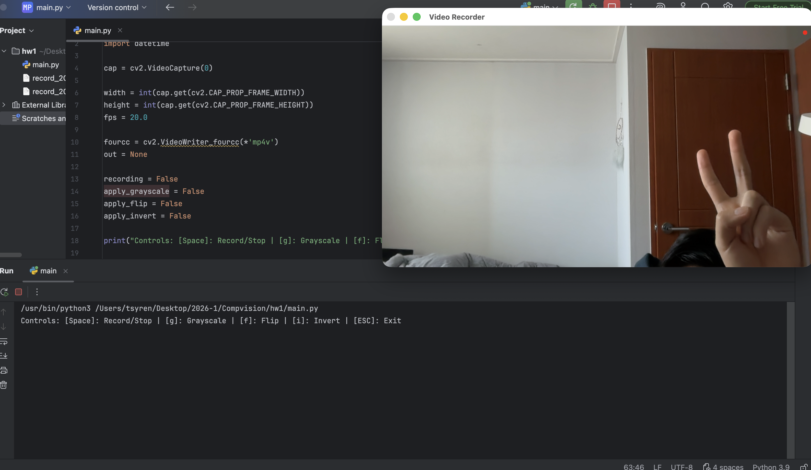

# Smart Cam Recorder

My simple video recorder using OpenCV. This program captures webcam footage and allows users to record videos with multiple optional real-time image filters.

## 🛠 Features & Controls
* **Preview & Record Mode**: Press the `Space` bar to toggle between previewing the camera feed and recording the video.
* **Recording Indicator**: A red circle appears in the top right corner of the screen while recording is active.
* **Filter: Grayscale (Extra Feature)**: Press `g` to toggle a black-and-white filter.
* **Filter: Horizontal Flip (Extra Feature)**: Press `f` to mirror the camera feed horizontally.
* **Filter: Invert Colors (Extra Feature)**: Press `i` to apply a negative color effect.
* **Custom Video Settings**: Recorded videos are automatically saved with a timestamped filename using the `mp4v` codec (FourCC) at 20 FPS.
* **Exit**: Press the `ESC` key to close the application safely.

## 💻 Requirements
* Python 3.x
* OpenCV (`pip install opencv-python`)

## 🚀 How to Run
1. Clone this repository to your local machine.
2. Run the script: `python <your_file_name>.py`
3. Use the keyboard controls (`Space`, `g`, `f`, `i`, `ESC`) to interact with the recorder.

## 📸 Demo
 
